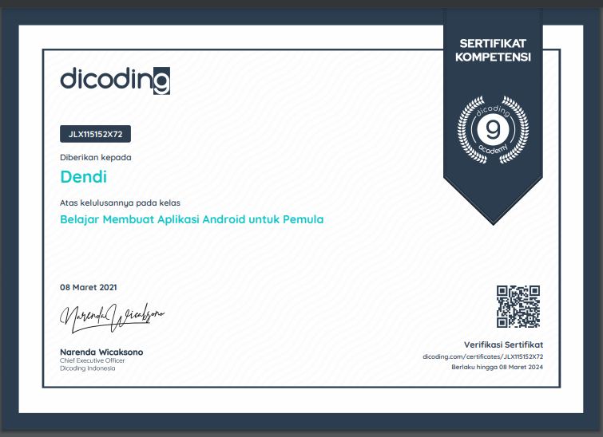

# OrganManusia-Aplikasi-Android-untuk-Pemula-Dicoding

this application about human body organs. The purpose of choosing this theme is to increase children's knowledge about organs.
This application is built to complete dicoding submissions, Belajar membuat aplikasi android untuk pemula
1. Recycleview
2. CardView
3. Intent with data
4. Intent

# Interface 

SplashScreen | Home | Detail | Share | Profil
--- | --- | --- | --- | --- 
 |  |  |  | 

# Instalation 
CLone this repository using git.
> git clone https://github.com/Dendi6/OrganManusia-Aplikasi-Android-untuk-Pemula-Dicoding.git

# Sertifikat

